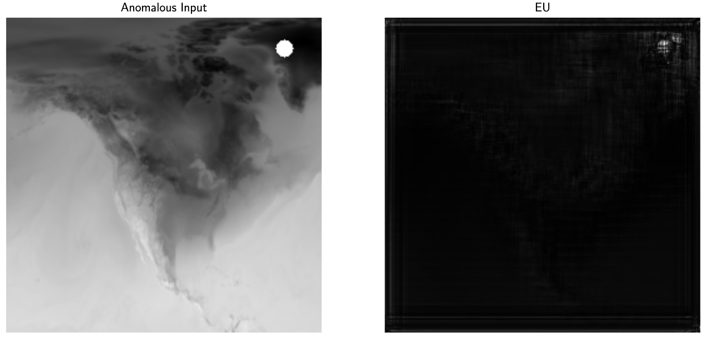

# Hyper-Diffusion Models (HyperDM)
*Authors: [Matthew A. Chan](https://www.cs.umd.edu/~mattchan/), [Maria J. Molina](https://mariajmolina.github.io/), [Christopher A. Metzler](https://www.cs.umd.edu/~metzler/)*

This is the official codebase for the NeurIPS 2024 paper ["Estimating Epistemic and Aleatoric Uncertainty with a Single Model"](https://arxiv.org/abs/2402.03478).

### Abstract

> "Estimating and disentangling epistemic uncertainty, uncertainty that is reducible with more training data, and aleatoric uncertainty, uncertainty that is inherent to the task at hand, is critically important when applying machine learning to high-stakes applications such as medical imaging and weather forecasting. Conditional diffusion models' breakthrough ability to accurately and efficiently sample from the posterior distribution of a dataset now makes uncertainty estimation conceptually straightforward: One need only train and sample from a large ensemble of diffusion models. Unfortunately, training such an ensemble becomes computationally intractable as the complexity of the model architecture grows. In this work we introduce a new approach to ensembling, hyper-diffusion models (HyperDM), which allows one to accurately estimate both epistemic and aleatoric uncertainty with a single model. Unlike existing single-model uncertainty methods like Monte-Carlo dropout and Bayesian neural networks, HyperDM offers prediction accuracy on par with, and in some cases superior to, multi-model ensembles. Furthermore, our proposed approach scales to modern network architectures such as Attention U-Net and yields more accurate uncertainty estimates compared to existing methods. We validate our method on two distinct real-world tasks: x-ray computed tomography reconstruction and weather temperature forecasting."

# Usage

### Dependencies

Using Python (v3.11.9), please install dependencies by running:

```sh
$ pip install -r requirements.txt
```

## Toy Experiment

We include `Makefile` build targets for generating toy experiment figures.

- To visualize HyperDM results, run `make toy_result.pdf`.
- To visualize deep ensemble results, run `make toy_baseline.pdf`.

|   `toy_result.pdf`   |     `toy_baseline.pdf`     |
| :------------------: | :------------------------: |
|  |  |

**Note:** As mentioned in our paper, AU is unreliable (and should be disregarded) when EU is high.

## Surface Temperature Forecasting Experiment

Run `make era5_result.pdf` to train HyperDM on [ERA5](https://www.ecmwf.int/en/forecasts/dataset/ecmwf-reanalysis-v5) and validate EU on an out-of-distribution test input. 

**Note:** On your first run, download the dataset by adding the `--download` flag to ERA5 build instructions in `Makefile`.

| `era5_result.pdf` |
| :------------------: |
|  |

# Citation

Please cite us if you found our work useful :)

```
@article{chan2024hyper,
  title={Estimating Epistemic and Aleatoric Uncertainty with a Single Model},
  author={Chan, Matthew A and Molina, Maria J and Metzler, Christopher A},
  journal={arXiv preprint arXiv:2402.03478},
  year={2024}
}
```
